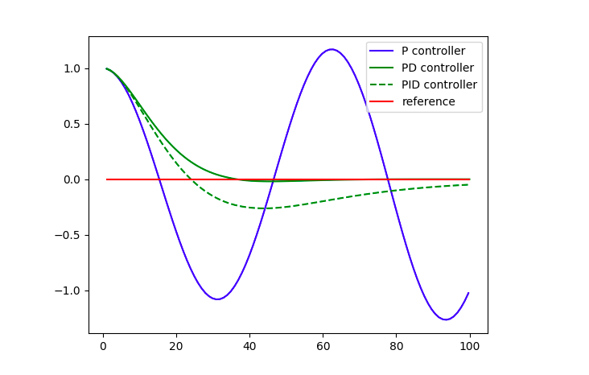

- 为什么要引入PID

  1. 如果只有比例P，这时候车辆会出现波荡，在参考线附近徘徊，迟迟不能达到理想状态，显然坐这样的车是很不舒服的。
  2. 为解决如上的情况，引入导数项D，**注意：这是一个“抵抗力”，会使得车达到参考线的时间变长，但是却使路线更平滑**。
  3. 因为P和D是一对反作用角度，所以会出现当两个转向角的大小一样，方向相反的问题使得最终角度为0，但是实际并没有达到参考线，这个时候引入积分项I，使得路线和参考线的面积尽可能小，过大的积分项参数Ki会使得无人车在运动的时出现波动，过小的积分项参数Ki会使得无人车在运动的时候很久不能到达 目标点。

- 初始化参数，手动调整的

  ```c++
  // 调整PID参数
  // 1，0，0 也能绕跑道形式，但是会出现大的转动
  // 0.1，0，0 不会出现大的摆动
  // 0，1，0 出来就撞到了
  // 0，0.1，0 出来就撞到了
  // 0，0.001，0 出来就撞到了
  // 0，0.0001，0 不会转向
  // 1，0.001, 0车还是有点会摇晃
  // 0.8，0.001, 0车还是有点会摇晃
  // 0，0, 1 方向盘来回摆动
  // 0，0,　0.1 大转弯的时候被撞上了
  // 0，0,　0.1５ 压线了
  // 0，0,　0.5 可以跑一圈了
  // 0.１，0.0001, 0.５
  double Kp = 0.1;
  double Ki = 0.001;
  double Kd = 0.5;
  pid.Init(Kp, Ki, Kd);
  ```

- 计算误差

  ```c++
  #include "PID.h"

  using namespace std;

  /*
   * TODO: Complete the PID class.
   */

  PID::PID() {
  }

  PID::~PID() {
  }

  // 初始化PID参数
  void PID::Init(double Kp, double Ki, double Kd) {
    this->Kp = Kp;
    this->Ki = Ki;
    this->Kd = Kd;

    p_error = 0.0;
    i_error = 0.0;
    d_error = 0.0;
  }

  // 更新误差
  void PID::UpdateError(double cte) {
    p_error = cte;
    i_error = i_error + cte;
    d_error = cte - d_error;
  }

  // 计算总误差
  double PID::TotalError() {
    return Kp * p_error + Ki * i_error + Kd * d_error;
  }
  ```

- twiddle, python实现代码展示

  ```python
  # ----------------
  # User Instructions
  #
  # Implement twiddle as shown in the previous two videos.
  # Your accumulated error should be very small!
  #
  # You don't have to use the exact values as shown in the video
  # play around with different values! This quiz isn't graded just see
  # how low of an error you can get.
  #
  # Try to get your error below 1.0e-10 with as few iterations
  # as possible (too many iterations will cause a timeout).
  #
  # No cheating!
  # ------------

  import random
  import numpy as np
  import matplotlib.pyplot as plt

  # ------------------------------------------------
  # 
  # this is the Robot class
  #
  class Robot(object):
      def __init__(self, length=20.0):
          """
          Creates robot and initializes location/orientation to 0, 0, 0.
          """
          self.x = 0.0
          self.y = 0.0
          self.orientation = 0.0
          self.length = length
          self.steering_noise = 0.0
          self.distance_noise = 0.0
          self.steering_drift = 0.0

      def set(self, x, y, orientation):
          """
          Sets a robot coordinate.
          """
          self.x = x
          self.y = y
          self.orientation = orientation % (2.0 * np.pi)

      def set_noise(self, steering_noise, distance_noise):
          """
          Sets the noise parameters.
          """
          # makes it possible to change the noise parameters
          # this is often useful in particle filters
          self.steering_noise = steering_noise
          self.distance_noise = distance_noise

      def set_steering_drift(self, drift):
          """
          Sets the systematical steering drift parameter
          """
          self.steering_drift = drift

      def move(self, steering, distance, tolerance=0.001, max_steering_angle=np.pi / 4.0):
          """
          steering = front wheel steering angle, limited by max_steering_angle
          distance = total distance driven, most be non-negative
          """
          if steering > max_steering_angle:
              steering = max_steering_angle
          if steering < -max_steering_angle:
              steering = -max_steering_angle
          if distance < 0.0:
              distance = 0.0

          # apply noise
          steering2 = random.gauss(steering, self.steering_noise)
          distance2 = random.gauss(distance, self.distance_noise)

          # apply steering drift
          steering2 += self.steering_drift

          # Execute motion
          turn = np.tan(steering2) * distance2 / self.length

          if abs(turn) < tolerance:
              # approximate by straight line motion
              self.x += distance2 * np.cos(self.orientation)
              self.y += distance2 * np.sin(self.orientation)
              self.orientation = (self.orientation + turn) % (2.0 * np.pi)
          else:
              # approximate bicycle model for motion
              radius = distance2 / turn
              cx = self.x - (np.sin(self.orientation) * radius)
              cy = self.y + (np.cos(self.orientation) * radius)
              self.orientation = (self.orientation + turn) % (2.0 * np.pi)
              self.x = cx + (np.sin(self.orientation) * radius)
              self.y = cy - (np.cos(self.orientation) * radius)

      def __repr__(self):
          return '[x=%.5f y=%.5f orient=%.5f]' % (self.x, self.y, self.orientation)

  ############## ADD / MODIFY CODE BELOW ####################
  # ------------------------------------------------------------------------
  #
  # run - does a single control run
  def make_robot():
        """
        Resets the robot back to the initial position and drift.
        You'll want to call this after you call run.
        """
        robot = Robot()
        robot.set(0, 1, 0)
        robot.set_steering_drift(10 / 180 * np.pi)
        return robot
     
  #NOTE: We use params instead of tau_p, tau_d, tau_i
    def run(robot, params, n=100, speed=1.0):
        x_trajectory = []
        y_trajectory = []
        err = 0
        prev_cte = robot.y
        int_cte = 0
        for i in range(2 * n):
            cte = robot.y
            diff_cte = cte - prev_cte
            int_cte += cte
            prev_cte = cte
            steer = -params[0] * cte - params[1] * diff_cte - params[2] * int_cte
            robot.move(steer, speed)
            x_trajectory.append(robot.x)
            y_trajectory.append(robot.y)
            if i >= n:
                err += cte ** 2
        return x_trajectory, y_trajectory, err / n

  # 使用twiddle算法，计算参数
    def twiddle(tol=0.2): 
        p = [0, 0, 0]
        dp = [1, 1, 1]
        robot = make_robot()
        x_trajectory, y_trajectory, best_err = run(robot, p)
        it = 0
        while sum(dp) > tol:
            print("Iteration {}, best error = {}".format(it, best_err))
              # 遍历每一个参数，调整参数值
              for i in range(len(p)):
                p[i] += dp[i]
                robot = make_robot()
                x_trajectory, y_trajectory, err = run(robot, p)
      
                if err < best_err:
                    best_err = err
                    dp[i] *= 1.1
                else:
                    p[i] -= 2 * dp[i]
                    robot = make_robot()
                    x_trajectory, y_trajectory, err = run(robot, p)
      
                    if err < best_err:
                        best_err = err
                        dp[i] *= 1.1
                    else:
                        p[i] += dp[i]
                        dp[i] *= 0.9
            it += 1
        return p

    params, err = twiddle()
    params, err = twiddle()
    print("Final twiddle error = {}".format(err))
    robot = make_robot()
    x_trajectory, y_trajectory, err = run(robot, params)
    n = len(x_trajectory)
    fig, (ax1, ax2) = plt.subplots(2, 1, figsize=(8, 8))
    ax1.plot(x_trajectory, y_trajectory, 'g', label='Twiddle PID controller')
    ax1.plot(x_trajectory, np.zeros(n), 'r', label='reference')
  ```

  
